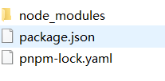

# 1.从零用VitePress搭建个人轻型博客的正确姿势(1)

## 一、写在前面

最近在想更新一把自己的前端吧小博客，但发现wordPress版本停留在了5年之前，发现变化挺大，不支持在线直接更新，服务器正在运行的php等环境完全不支持wordPress最新版本。如果想使用最新版本，服务器环境配置必须更新，只能慢慢折腾了。

然后在想能不能用vitePress + CMS探索重构的可能性，所以接下来这是自己用vitePress搭建的纯文档博客的步骤，在此记录一下。

## 二、vitePress相关文档

首先我们要知道，VitePress 是 [VuePress](https://vuepress.vuejs.org/) 小兄弟, 它基于 [Vite](https://github.com/vitejs/vite)构建的，而[VuePress](https://vuepress.vuejs.org/) 是基于 Webpack构建的。

VitePress使用vite和Vue3的驱动的静态站点生成器，比之VuePress更加简约、轻型和高效。特点如下

- 开发服务器启动更快
- 热更新更快
- 构建更快(内部使用 Rollup)

更多不同可以查看文档：https://vitejs.cn/vitepress/#motivation

**官方英文文档**：https://vitepress.dev/

**中文文档**：

https://vitejs.cn/vitepress/

https://vitepress.qzxdp.cn/reference/site-config.html


## 三、初始化项目

### 1、创建项目目录并初始化

创建一个qianduan8目录，进入到目录，执行初始化命令

```js
pnpm init
```

### 2、本地项目安装VitePress

```javascript
pnpm add -D vitepress
```




### 3、配置项目目录结构

我们创建一个**docs/.vitepress**的目录和配置文件、首页，public。

开始我们创建的目录结构如下所示:

```javascript
├─ docs
│  ├─ .vitepress
│  │  └─ config.js
│  └─ index.md
│  └─ public
└─ package.json
```

说明如下：

**docs/.vitepress:**  用于存放全局的配置、自定义组件， 自定义主题（theme）等。

- config.js:  项目配置文件。

**public:**  公共文件目录，存放静态资源目录。（之后在首页和主题配置里可以直接使用 “/logo.png”引入）

**index.md**：则是站点的首页。

其中，config.js是配置VitePress网站的必要条件，它将导出一个JS对象，如果项目越来越大时，配置可以抽出来。

config.js初步配置：

```javascript
export default {
  title: '前端吧',
  description: '关注web前端开发为主的博客网站和前端网址大全',
  // 打包目录
  outDir: './dist',
   head: [
		// 添加图标
		['link', { rel: 'icon', href: '/favicon.ico' }]
	],
}
```

如上所示，我们只简单地设置了**网站标题，网站描述，打包的 dist 目录，以及网站图标**，后面更多配置都是在config.js这个文件完成。

### 4、配置运行脚本

在package.json下配置，如下：

```javascript
  "scripts": {
    "docs-dev": "vitepress dev docs",
    "docs-build": "vitepress build docs",
    "docs-serve": "vitepress serve docs"
  }
```

### 5、本地运行

执行如下命令

```javascript
pnpm docs-dev
```

结果如下：


运行成功，不过目前网站是空的，只有一个logo标题，那么，接下来我们需要不断完善，比如配置导航，首页、自定义模板等等

